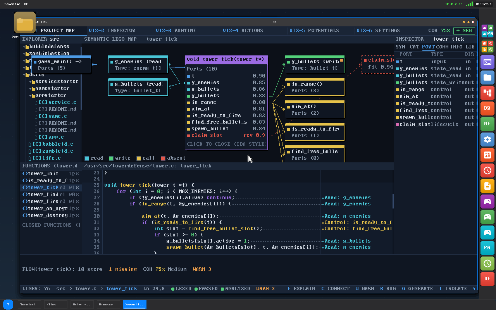
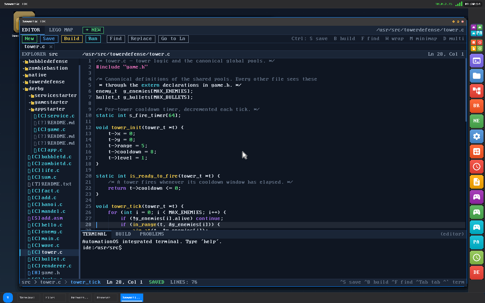
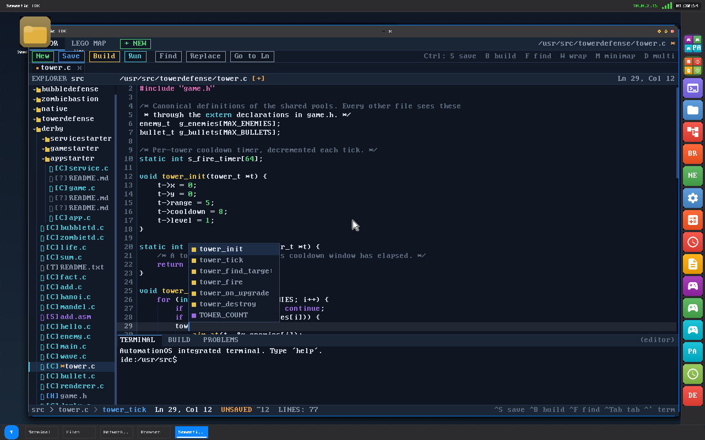
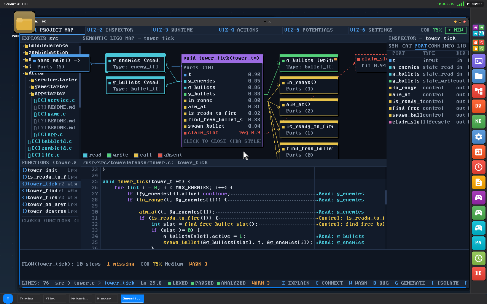
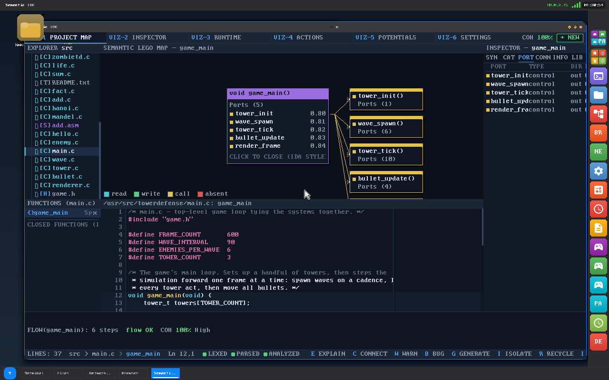
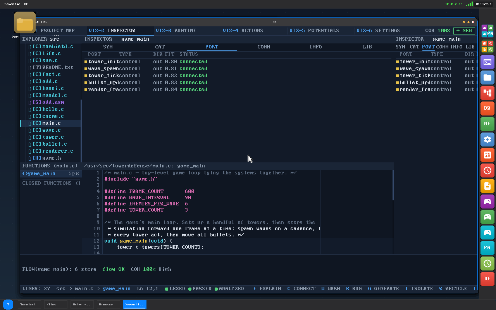
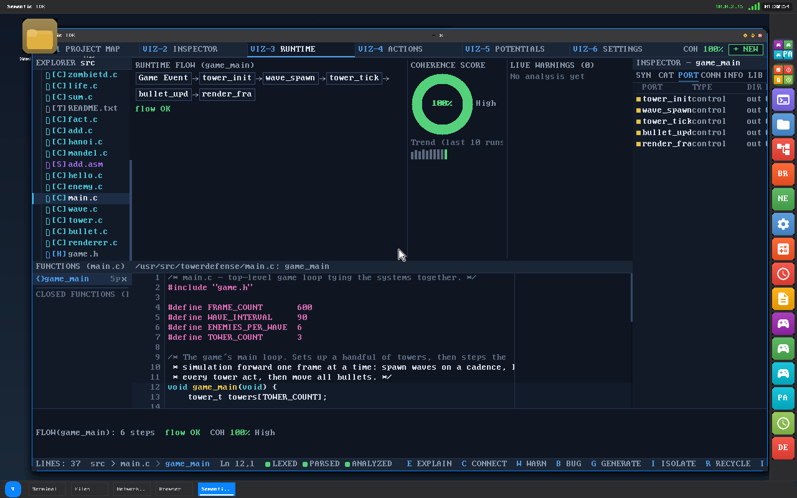
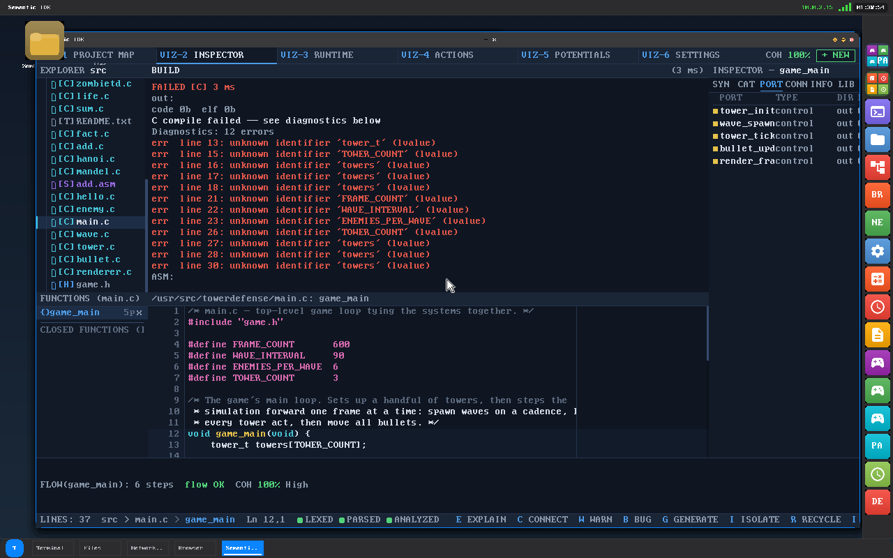
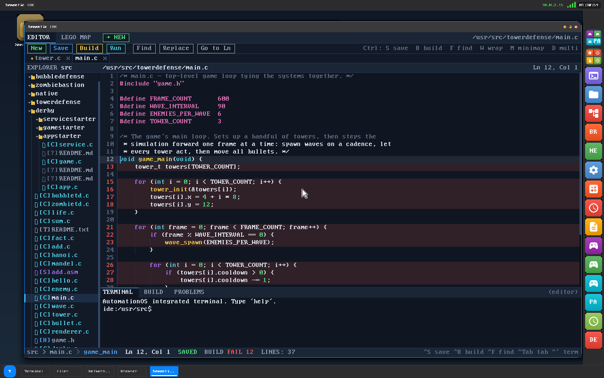
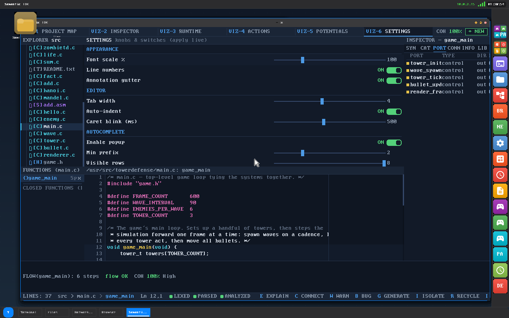

# The Semantic LEGO IDE

### An IDE that *is* the mental image — built for programmers with aphantasia, running on a from-scratch OS, compiling C with its own on-device compiler.



> One frame, one thought: `tower_tick` as a brick. Its ten ports scored by
> affinity. What it **reads** (cyan), what it **writes** (green), what it
> **calls** (yellow) — and in dashed red, `claim_slot`: a function the code
> *needs but does not have*. The hole in your mental model, rendered instead
> of imagined. Below it, the actual source with every line annotated by its
> semantic effect. On the right, the same selection as a table. One
> selection model drives all of it.

---

## Why this exists

Most IDEs assume you can close your eyes and *see* your program — hold the
call graph in your head, picture which function touches which state, keep a
spatial map of the codebase as you navigate. **Aphantasic programmers cannot
form those images.** For them, every "just remember where you are" moment is
a tax the tooling never acknowledges.

The Semantic LEGO IDE inverts the assumption. It is built as a **prosthetic
working memory**: the map, the inspector tables, the flow narrative and the
breadcrumb *are* the mental image, externalized onto the screen and kept in
sync with the code at all times. The design laws fall straight out of that:

1. **Nothing lives only in your head.** If the program model matters, it is
   drawn — connections, state access, missing pieces, health.
2. **Always-visible context.** Where am I (`src > tower.c > tower_tick
   Ln 29,8`), what is connected, what changed since the last save (the `[+]`
   star) — permanently in the chrome, never a command away.
3. **Verbal and spatial in sync.** Every spatial fact (a box, an edge) has a
   symbolic twin (a table row, a breadcrumb, a flow sentence). Aphantasia is
   not one condition; the IDE speaks both languages simultaneously.
4. **Stable layout.** The same function lives in the same place every time
   the map opens. A map that reshuffles is a map you must re-memorize —
   the exact thing this tool exists to prevent.
5. **One selection model.** The caret, the map node, the inspector row and
   the breadcrumb are views of a single `active file/line/symbol/node`
   record. Touch any pane and every pane follows. Until that loop was
   tight, the map was only a picture; with it, it becomes external memory.

---

## The tour

Every screenshot below is a real frame from a QEMU boot of AutomationOS,
captured by the repeatable keyboard-driven tour in
`build_test/ide_showcase_shots.sh`. Nothing is mocked.

### The editor is a real editor



Syntax highlighting from the IDE's own lexer, a project explorer, tabs,
find/replace/goto, undo/redo, multi-cursor, word wrap, minimap, an
integrated terminal — and the status spine: breadcrumb, caret position,
save state, line count, live key hints. The annotation gutter and the
`LEXED ▸ PARSED ▸ ANALYZED` chips show the semantic pipeline running behind
every keystroke.

### Completion that knows your project



Type three letters and the popup lists the *project's own symbols* —
`tower_init`, `tower_tick`, `tower_find_target`… — extracted by the live
parser, not a static dictionary. Note the chrome reacting: the tab dot, the
`[+]` what-changed star on the path, `UNSAVED ~12` in the status bar. The
IDE always tells you what state your work is in.

### The map: functions as bricks, state as ports


The central card is the function under the caret. Its **ports** are every
piece of state and control it touches, scored by affinity. Satellites are
its world: type cards for the globals it reads, call cards for what it
invokes, and — the novel part — **absent cards** in dashed red for
references that don't resolve. A missing function is not a build error
waiting to happen; it is a visible, labeled hole with a fit score
(`claim_slot · fit 0.94`) suggesting how well a candidate would slot in.

`COH 75%` in the corner is the **coherence score** — the project's health
expressed as a single order parameter, computed from unresolved references,
flow breaks and analysis warnings. Watch it move as you work: it is the
"how bad is it really?" number that normally lives in a senior engineer's
gut.

### Follow an edge — the map is navigation, not decoration



Arrow keys walk the satellites; Enter follows one. The central card,
the breadcrumb, the inspector and the code panel all jump together —
because they share the one selection model.

### …even across files



Following `game_main` — the incoming caller, defined in a *sibling file* —
opens `main.c`, lands the caret on the definition, and rebuilds every pane:
breadcrumb now reads `src > main.c > game_main`, the map re-centers, the
flow strip reports `FLOW(game_main): 6 steps · flow OK · COH 100% High`.
The map spans the project, not the open buffer.

### The same truth as tables



Every port in the map is a row here — name, type, direction, fit, status —
under `SYN / CAT / PORT / CONN / INFO / LIB` tabs. For readers who think in
lists rather than space, this *is* the map. Same selection, same data,
different language.

### The runtime story



`VIZ-3 RUNTIME` renders the call flow as a left-to-right narrative chain —
`Game Event → tower_init → wave_spawn → tower_tick → …` — with the
coherence donut and a ten-run trend. Execution order is exactly the kind of
sequential-spatial structure aphantasic programmers cannot replay
internally; here it is a sentence you can read.

### Build inside, on-device — and failures point home



`B` runs the IDE's **own C toolchain** — lexer, recursive-descent parser,
type checker, x86-64 codegen, assembler and ELF writer, all running *inside
AutomationOS* — and streams diagnostics into the build view in
milliseconds. Failures flow back into the editor as red line highlights
with a `BUILD FAIL` chip in the status bar:



(Honesty note: this very screenshot shows the demo project failing to
build, and the diagnostics naming exactly why — see *Honest status* below.)

### Live knobs



`VIZ-6 SETTINGS`: font scale, gutters, tab width, caret blink, completion
behavior — sliders and switches that apply live.

---

## The architecture (and what is actually novel)

```
                  ┌────────────────────────────────────────┐
                  │           ONE SELECTION MODEL          │
                  │ active file · line · symbol · node     │
                  └───┬────────┬───────────┬───────────┬───┘
                      │        │           │           │
                 ┌────▼───┐ ┌──▼─────┐ ┌───▼─────┐ ┌───▼──────┐
                 │ EDITOR │ │  MAP   │ │INSPECTOR│ │BREADCRUMB│
                 │ caret  │ │ bricks │ │ tables  │ │  spine   │
                 └────┬───┘ └──┬─────┘ └───┬─────┘ └──────────┘
                      │        │           │
                  ┌───▼────────▼───────────▼───┐
                  │   LIVE SEMANTIC PIPELINE   │
                  │  lex → parse → analyze     │
                  │  (whole project, re-run    │
                  │   on edit; powers ports,   │
                  │   absent cards, COH, flow) │
                  └───────────┬────────────────┘
                              │
                  ┌───────────▼────────────────┐
                  │  ON-DEVICE C TOOLCHAIN     │
                  │  typecheck → x86-64 asm    │
                  │  → ELF, runs as a process  │
                  │  of the same from-scratch  │
                  │  OS the IDE runs on        │
                  └────────────────────────────┘
```

What you will not find in mainstream tools:

- **The selection model as a hard law, not a feature.** Panes are forbidden
  from owning private selection state. This single constraint is what makes
  the map *external working memory* instead of a diagram viewer: it cannot
  drift from the code, because there is nothing to drift.
- **Absence as a first-class render.** Architecture tools draw what exists.
  The LEGO map draws what the code *reaches for and misses* — dashed-red
  gate cards with fit scores. For a programmer who cannot visualize the gap
  between intention and implementation, drawing the gap is the entire game.
- **Coherence as an order parameter.** One number (`COH %`) per function,
  per flow, per project, continuously computed, with a visible trend. Code
  health stops being a feeling.
- **Line-level semantic narration.** The code panel annotates each source
  line with its effect (`Read: g_enemies`, `Control: is_ready_to_fire`) —
  the inner monologue of code reading, printed in the margin.
- **The whole loop is self-hosted.** The IDE renders through the OS's own
  compositor, parses with its own front-end, and compiles with the OS's
  on-device toolchain to ELF binaries the OS schedules. This is not an
  Electron app describing a remote toolchain; the blueprint, the code and
  the machine are one system.

---

## Honest status

This is a young system on a from-scratch OS. Sold honestly:

- **The on-device compiler is single-translation-unit and does not yet run
  a preprocessor** — `#include` and `#define` lines are skipped, not
  expanded. Self-contained, macro-free programs build and run from the IDE
  (the create→build→run→desktop-icon lifecycle is proven); the multi-file
  towerdefense demo *analyzes* fully (map, ports, cross-file follow) but
  its in-IDE build fails — and now says exactly why (`unknown identifier
  'tower_t'`, `'TOWER_COUNT'`, …), because the audit below made the
  diagnostics name names. The preprocessor is the roadmap item.
- **Keyboard interaction is machine-proven** (every screenshot here comes
  from injected keystrokes); mouse paths are validated on real hardware
  (ThinkPad T410).
- **Known cosmetic issue:** a desktop icon can paint over the top-left of a
  maximized window (visible in these screenshots) — a compositor damage
  bug under investigation, tracked in the audit notes.

## The showcase audit (what taking these pictures found)

Capturing this tour doubled as an adversarial audit. Found and fixed:

1. **Esc was a silent data-loss quit.** A global `ESC always exits` ran
   before the editor's key routing, so pressing Esc to close the completion
   popup exited the entire IDE — `exit(0)`, unsaved work discarded. The
   first capture run photographed the death frame by frame. Fixed: in the
   editor workspace Esc is an editing key (closes the popup, otherwise
   inert); in the LEGO workspace Esc still exits *unless* the buffer is
   dirty, in which case it returns you to the editor where the `UNSAVED`
   chip explains itself. The capture script now sends Esc deliberately as a
   regression probe.
2. **Anonymous diagnostics.** Twelve copies of `unknown identifier
   (lvalue)` told the user nothing. The compiler now names the identifier,
   which makes the single-TU limitation self-explaining at a glance.
3. **Recorded for follow-up:** the icon-over-window compositor artifact
   (stable, reproducible, every frame), and the inspector sidebar
   duplicating the center panel when `VIZ-2` is active (a candidate for a
   complementary view instead).

Reproduce everything: `IDE=1 bash scripts/build_all.sh` then
`bash build_test/ide_showcase_shots.sh` (QEMU + QMP; no human hands).

---

*Part of [AutomationOS](https://github.com/The404Studios/AutomationOS) — a
from-scratch x86-64 operating system with its own compositor, network
stack, on-device C compiler, and a two-core scheduler brought up brick by
proven brick.*
