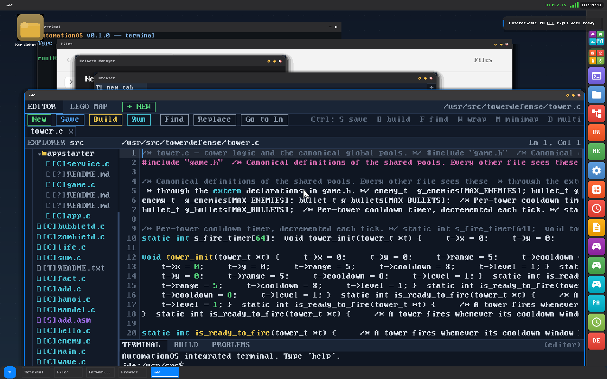
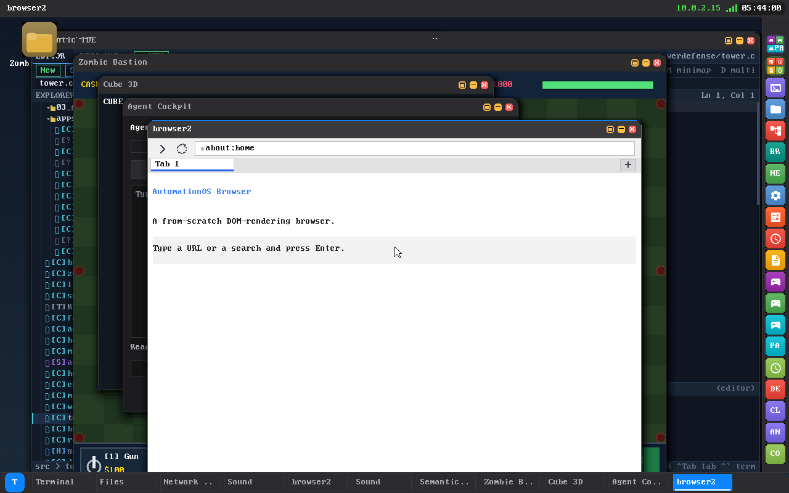
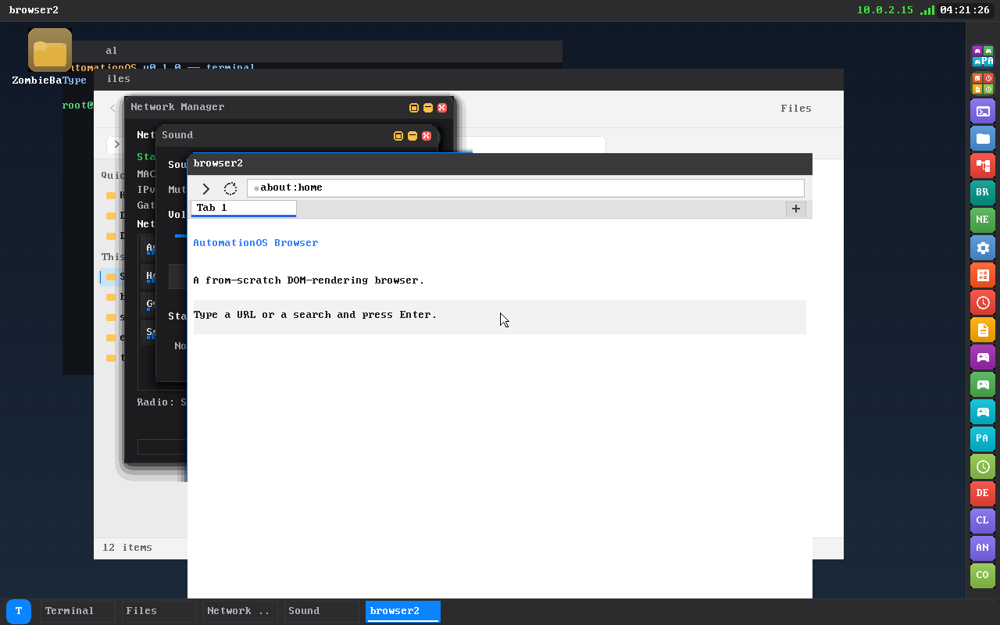
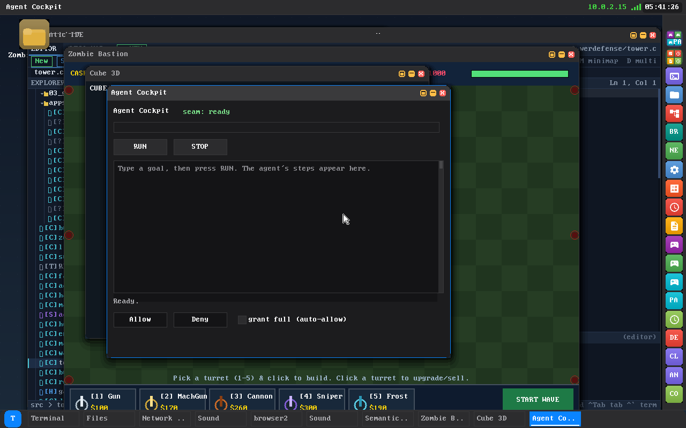

# AutomationOS: The Most Novel Feats

A curated tour of the genuinely hard things AutomationOS does **from scratch** — no Linux, no BSD, no libc underneath.

> **Note:** Every feat below links the *why it is hard* to the code that does it. If you read only one doc to understand why this OS is unusual, read this one.

AutomationOS is a from-scratch x86-64 hobby OS. A 32-bit Multiboot stub bootstraps long mode, a higher-half 64-bit kernel brings up its own memory management, scheduler, drivers, filesystems, and network stack, then hands off to a hand-written compositor desktop. It runs in QEMU **and** boots from USB on a **2010 Lenovo ThinkPad T410**. The whole boot-to-desktop path is verified by `scripts/smoke_boot.sh` (**43/43 invariant checks**), and a `GAMETEST=1` harness proves **25/25** games and apps spawn and survive.

---

## 1. Self-hosting compiler: it compiles its own software, on itself

Write C in the IDE, build it, and run it — all on the running OS.

**The feat.** Write C in the IDE, press **Ctrl+B**, run it with **Ctrl+R** — the compilation happens *on the running OS*. `cc` (`userspace/apps/cc/cc.c`) lexes, parses, builds an AST, generates Intel-subset x86-64, assembles to machine code, then writes a static **ELF64** the loader runs. No host toolchain is involved at runtime; the system is **self-hosting** for the subset of C it supports.

**Why it is hard.** A self-hosting compiler is the classic "is it a real OS?" bar. You need a front end (lexer/parser/type rules), a code generator that respects the System V ABI, an assembler that emits correct machine encodings, and an ELF writer that produces a binary your own loader will actually execute — all freestanding, with **no libc, no malloc, no stdio**, only fixed static buffers. The editor and the compiler must also agree byte-for-byte, or "build" and "what the IDE shows" diverge.

**The code.**

- `userspace/apps/cc/cc.c` — the `/bin/cc` driver. It is deliberately a *thin* driver that **reuses the IDE's verified toolchain**, mirroring the exact pipeline `parse → cc_compile → as_assemble @ TC_ENTRY_VADDR → elf_write`.
- `userspace/apps/ide/` — the shared front end: `ide_parser`, `ide_ast`, `tc_driver.c` (`tc_build()`), codegen, the assembler (`as_assemble`), and the ELF writer (`elf_write`).
- Generated programs carry their own `_start` trampoline (`call main; mov rdi,rax; mov rax,0; syscall`), so output ELFs are self-contained and don't even need crt0.

**Honest scope.** `cc` compiles a *careful subset* of C — integer and pointer types are 64-bit (`char`/`_Bool` = 1 byte), with functions (≤6 params, recursion), `if`/`else`/`while`/`for`, the full operator set, string literals, arrays, pointers, struct member layout, and `sys_write` / `sys_exit` builtins that emit `syscall`. **No floats, no `switch`, single-file.** That is enough to be self-hosting *for that subset*, not a full C11 compiler.

---

## 2. Its own web browser reaches the real internet over its own TLS 1.3

A from-scratch browser on a hand-rolled TLS stack, talking to live CDNs.

**The feat.** `browser2` (`userspace/apps/browser2/`) is a from-scratch browser — its own **DOM, HTML parser, CSS engine, layout engine, and an ES5-subset JavaScript interpreter** with web APIs (timers, fetch, localStorage, console, URL) — sitting on a **hand-rolled TLS 1.2 *and* TLS 1.3** stack. It has fetched live `cloudflare.com` over HTTPS with a **trusted** certificate.

**Why it is hard.** Each layer here is a project in itself. A browser needs an HTML5 tokenizer, a tree builder, a CSS cascade, a box-model layout pass, *and* a JS engine to be remotely useful — and then it needs a TLS stack underneath that real CDNs will actually talk to. TLS 1.3 (RFC 8446) is unforgiving: get the HKDF key schedule, the AEAD record layer, or the transcript hash wrong by one byte and the handshake silently fails.

**The code.**

- `userspace/apps/browser2/` — DOM, HTML, CSS, layout, ES5 JS, and web APIs.
- `userspace/lib/tls/tls13_keysched.c`, `tls13_record.c`, `tls13_handshake.c`, `tls13_certverify.c` — the TLS 1.3 implementation, **known-answer-proven against RFC 8448**.
- Cryptographic primitives under `userspace/lib/crypto/`: `sha1/256/384/512`, `md5`, `hmac`, `hkdf`, `aes` (`ccm`/`gcm`), `chacha20poly1305`, `rsa` (+ `rsa_pss`), `p256`, `p384`, X25519, `bignum`, `base64`. ECDHE via **X25519 + P-256** (P-384 also implemented), with **RSA-PSS** and **ECDSA** `CertificateVerify`.
- Certificate trust is real: full X.509 **chain verification** (`x509_verify_chain`), not the old "unverified cert" path.

Offer TLS 1.3 at build time with `TLS13=1`.

---

## 3. A from-scratch Intel WiFi driver, with firmware auto-select and on-screen diagnostics

A hand-written iwlwifi DVM driver that reports its own bring-up state into the desktop.

**The feat.** A hand-written **Intel iwlwifi DVM** driver for the T410's Intel 1000/5000/6000 radios, living in `kernel/drivers/net/wireless/intel/iwlwifi/`. It does APM power-up plus DMA rings, parses and DMA-loads firmware to reach runtime **ALIVE**, reads the **EEPROM/OTP** NVM for the MAC and channel list, programs **RXON**, and runs a **passive scan** that harvests beacons into the network list. It **auto-selects the right firmware** for whichever card is present, detects hardware **RF-kill**, and **surfaces its bring-up state into the Network Manager GUI** so the radio can be diagnosed *on-screen* — no serial cable required.

**Why it is hard.** A WiFi driver is one of the most punishing things to write from scratch: thousands of lines of register-level choreography against opaque firmware, with DMA rings, host commands, a scheduler (SCD), and timing dependencies that have **no emulator** — QEMU does not model the iwlwifi RF tail, so the radio half can only be iterated on physical silicon. Doing this *without* a serial cable means the device must report *where* bring-up stalled, into a desktop GUI.

**The code.**

- `iwl-trans.c` — APM power sequence plus TX/RX DMA rings (the transport layer).
- `iwl-fw.c` / `iwl-fw-load.c` (+ `iwl-fw-file.h`) — firmware image parse and DMA load → ALIVE.
- `iwl-hostcmd.c` — the host-command path plus SCD (scheduler) setup.
- `iwl-nvm.c` — EEPROM / OTP NVM read (MAC + channels).
- `iwl-rxon.c` — RXON station/BSS configuration.
- `iwl-scan.c` — the passive scan.
- `iwl-ops.c` — the `wifi_ops` seam plus `iwl_wifi_bringup()` (the single held top-level entry) and `iwl_fw_candidates()` (the firmware auto-select table keyed by card family).
- `iwl-pci.c`, `iwl-csr.h`, `iwl-devices.h`, `iwl-dvm-commands.h` — PCI probe, register defs, and DVM command set.

**Boot KATs (software-provable half, in QEMU).** `IWL-RXON`, `IWL-SCAN`, `IWL-FWSEL` (`iwl_fwselect_selftest()`), and `IWL-FW` all **PASS**.

**Bring-up is post-desktop, never at boot.** `iwl_wifi_bringup()` is *not* called from any boot path; it is triggered after the desktop is up by `userspace/apps/iwlup/iwlup.c`. RF-kill is read from `CSR_GP_CNTRL` and re-checked live, so the user can flip the physical switch at any time.

**On-screen diagnostics.** `SYS_WLAN_DIAG (124)` (`kernel/net/wifidiag.c`, `kernel/include/uapi/wlan.h`) reports a **monotonic bring-up stage** — `NONE → NOCARD → DETECTED → TRANS_OK → ALIVE → NVM_OK → REGISTERED → SCANNED` (or `FAILED` with the failing step in a 64-char message) — plus card name, family, RF-kill, MAC, and channel count. The **Network Manager** (`userspace/apps/netman/`) renders this as a live `Radio:` line, so you can watch exactly where the radio gets on real hardware.

**Simulated backend.** `kernel/drivers/net/wireless/sim/wifisim.c` (build with `WIFI_SIM=1`) gives a full scan → connect → DHCP → IP path that works entirely in QEMU.

See **[docs/T410_IWLWIFI.md](T410_IWLWIFI.md)** for the hardware bring-up procedure.

---

## 4. WPA2 and WPA3-SAE: a complete supplicant

A from-scratch supplicant covering both the legacy 4-way handshake and the modern dragonfly exchange.

**The feat.** `userspace/apps/wpasupp/wpasupp.c` is a from-scratch supplicant: **WPA2** (PBKDF2 key derivation, the 4-way handshake, CCMP/GCMP) **and** the **WPA3-SAE** "dragonfly" handshake (PWE → commit → confirm → PMK). The control plane goes through the WiFi syscalls; the supplicant installs the PTK/GTK via `SYS_WLAN_SET_KEY (117)`.

**Why it is hard.** SAE is the modern, deliberately-strong handshake: it does *hunting-and-pecking* to map a password to an elliptic-curve point (PWE) on **NIST P-256**, then a commit/confirm exchange that yields the PMK — all of which must match IEEE 802.11-2020 §12.4 and RFC 7664 exactly, or you simply do not associate.

**The code.**

- `userspace/lib/crypto/sae.c` — the SAE dragonfly handshake, group 19 (P-256), freestanding, fixed stack buffers only.
- `userspace/lib/crypto/pbkdf2.c`, `ccmp.c`, `gcmp.c`, `keywrap.c` — WPA2 derivation plus ciphers.
- All of it is **KAT-proven** in the boot `cryptotest` battery (`userspace/lib/crypto/cryptotest.c`).

---

## 5. A gated AI agent that can drive the OS

A host LLM automates the machine through a capability-gated tool surface, under human supervision.

**The feat.** The "agent rail": a host LLM automates the machine (shell, files, **synthetic mouse + keyboard**) through a **capability-gated** typed tool surface, under a human-supervised **cockpit** (Allow / Deny / STOP, live goal plus steps), with a **tamper-evident hash-chained audit ledger** and **rollback**. The model is treated as **hostile text** and never gets unmediated control.

**Why it is hard.** Letting an LLM touch a real machine is a security problem first and a plumbing problem second. The design has to assume every byte from the model is adversarial: every dangerous tool call must be intercepted at a gate (allow / require-confirm / deny), every action must be appended to an audit log that cannot be silently rewritten, and the operator needs a live veto. Synthetic input means generating mouse/keyboard events into the compositor as if a human typed them — a capability that is itself dangerous and therefore gated.

**The code.**

- `userspace/apps/agentd/agentd.c` — the OS-side gated agentic loop. It talks to the host broker over the slirp seam and gates each tool through the **deny + require-approval (CONFIRM)** bins, with a **policy floor** loaded from `/etc/ai/policy.json` that can only make the gate *stricter* (fail-safe: absent or unparseable policy → empty sets → hardcoded floor).
- `userspace/apps/cockpit/cockpit.c` — the human-supervised cockpit GUI (Allow / Deny / STOP).
- `scripts/*_broker.py` — the host-side brokers that bridge the LLM to the seam.

The confirm gate is proven 10/10; the ledger is hash-chained and verified live.

---

## 6. The Semantic LEGO Map IDE, built for aphantasia

An IDE that renders code as a navigable map — the visual model some developers cannot form in their heads.

**The feat.** `userspace/apps/ide/` renders code as a **navigable map of "blueprints" and data-flow** — the visual model a developer with aphantasia cannot form in their head — alongside a syntax-highlighting editor, a teaching dictionary, a snippet library, live re-parse, and the on-device **Ctrl+B build / Ctrl+R run** wired to `cc` (§1).

**Why it is hard.** This is not a syntax-highlighter; it is a *semantic* view. The IDE shares one verified front end (lexer/parser/codegen/assembler/ELF writer) with the compiler, re-parses on edit so newly-inserted "complexes" register in the blueprint immediately, and maps the caret across a tab-aware code view back onto the AST — all on a freestanding userland with no toolkit.

**The code.** `userspace/apps/ide/ide.c` (the Semantic LEGO Map), plus `ide_parser` / `ide_ast` / `tc_driver.c` (the shared front end, also used by `cc`).

---

## 7. Intel HDA sound from scratch

High-Definition Audio output with codec enumeration and DMA stream playback.

**The feat.** Intel **High-Definition Audio** output: codec enumeration via the **Immediate Command Interface**, plus **DMA stream playback**. A **Sound Manager** app (`userspace/apps/soundman/`) exposes volume, mute, test-tone, and live status over a `SYS_AUDIO_*` mixer surface.

**Why it is hard.** HDA is normally driven through the CORB/RIRB ring pair for codec command/response; getting reliable codec communication and a DMA-fed output stream working from zero — then keeping it off by default so it cannot destabilize the T410 boot — took real care.

**The code.** The HDA driver (gated by `HDA_ENABLE=1`, off by default), the `SYS_AUDIO_*` mixer syscalls, and `userspace/apps/soundman/`. See **[docs/AUDIO_SUBSYSTEM.md](AUDIO_SUBSYSTEM.md)**.

---

## 8. It boots on 14-year-old hardware, and scales across cores

A graphical desktop on a 2010 ThinkPad T410, with a gated multi-core build.

**The feat.** AutomationOS boots to a graphical desktop on a **2010 ThinkPad T410** (Intel Core i5-M520 "Westmere", NVIDIA NVS 3100M), RAM-rooted from initrd. A gated **SMP** build does real AP bring-up (INIT-SIPI-SIPI), per-CPU state, LAPIC timers, IPIs, and TLB shootdown, and runs ring-3 work on a second core.

**Why it is hard.** Real hardware does not forgive the shortcuts an emulator tolerates — boot hangs, MMIO stalls, and timing bugs that QEMU never shows. And SMP is its own minefield: every CPU must set CR0.PG / CR4 / EFER.LME / **EFER.NXE**, the runqueue and shootdown logic must be genuinely concurrency-safe, and a missed `sti; hlt` parks a core forever.

**Build flags.** `SMP=1` (multi-core) and `PREEMPT=1` (preemptive scheduler) are both implemented and validated but remain **opt-in** — the default is **cooperative + single-core**. See **[docs/SMP_ARCHITECTURE.md](SMP_ARCHITECTURE.md)**.

---

## 9. Real persistence plus self-heal recovery

Durable on-disk writes over AHCI, and a watchdog that restores the desktop session if the compositor dies.

**The feat.** A durable **diskfs** superblock over **AHCI/SATA** means writes survive a reboot (on top of the RAM-rooted ramfs plus ext2/FAT32 read support behind a VFS). A desktop **self-heal watchdog** restores the session — windows and all — if the compositor dies.

**Why it is hard.** Persistence requires a real on-disk format and an AHCI driver that survives power cycles. Self-heal requires an init-owned heartbeat in shared memory plus a way to re-register the windows of a process that just died — using a *failed* `shmat` on a dead client's SHM as the liveness test.

**The code.** The diskfs / AHCI path under `kernel/`, the VFS registry, and the self-heal watchdog (init-owned heartbeat SHM). See **[docs/RECOVERY_MECHANISMS.md](RECOVERY_MECHANISMS.md)** and **[docs/VFS_ARCHITECTURE.md](VFS_ARCHITECTURE.md)**.

---

## From-scratch analysis: what is built from zero

Nothing in the boot-to-desktop path depends on a third-party OS, kernel, libc, or GUI toolkit.

Userspace is freestanding and talks to the kernel only through a hand-written `SYSCALL`/`SYSRET` surface (`kernel/include/syscall.h`). Built by hand, from zero:

| Layer | What's hand-written |
|-------|---------------------|
| **Boot** | 32-bit Multiboot stub → long mode → higher-half 64-bit kernel |
| **Memory** | page-frame allocator, 4-level paging, slab + heap allocators, CoW fork, VMAs |
| **Scheduling** | cooperative core; gated **preemptive** (`PREEMPT=1`) + gated **SMP** (`SMP=1`) |
| **Drivers** | serial, PIT, RTC, PS/2 kbd+mouse, PCI, framebuffer, AHCI/SATA, e1000, **iwlwifi**, HDA |
| **Net** | Ethernet / ARP / IPv4 / ICMP / UDP / TCP / DNS + BSD sockets |
| **Crypto/TLS** | SHA-1/256/384/512, MD5, HMAC, HKDF, AES (CCM/GCM), ChaCha20-Poly1305, RSA(+PSS), X25519, P-256, P-384, ASN.1/X.509 chain verification, **TLS 1.2 + TLS 1.3**, WPA2 + **WPA3-SAE** |
| **Toolchain** | C compiler (`cc`) + assembler + ELF writer, on-device |
| **GUI** | compositor, window manager, dock, an integer-only (no-float) animation/widget toolkit |
| **Apps** | browser engine, IDE, 25+ games/apps, the AI agent rail |

The build *process* is the only thing that touches host tools (`gcc` / `nasm` / `ld` / `grub-mkrescue` / `qemu` to *produce* the image, under **WSL Arch** via `scripts/quick_build.sh` and `scripts/build_all.sh`). The **running system** uses none of them.

---

## Honest limitations

These feats are real, and so are their edges.

- **Cooperative + single-core by default.** `PREEMPT=1` / `SMP=1` are validated but opt-in.
- **GRUB Multiboot, legacy BIOS — not UEFI.**
- **The T410 WiFi *radio* tail has no emulator.** The driver logic is KAT-proven in QEMU (`IWL-RXON` / `IWL-SCAN` / `IWL-FWSEL` / `IWL-FW`), but firmware ALIVE → scan on real silicon is hardware-iterated on the physical T410 (now far easier with the on-screen `Radio:` diagnostics). **WiFi association and the WiFi data plane** (DHCP/traffic over `wlan0`) are the next milestones.
- **`cc` compiles a careful C subset** (no floats, no `switch`, single-file) — self-hosting for that subset, not full C11.

---

## See also

- **[README](../README.md)** · **[Wiki Home](wiki/Home.md)** · **[Architecture](ARCHITECTURE.md)**
- **[Self-Hosting Compiler](wiki/Self-Hosting-Compiler.md)** · **[Browser & Web Engine](wiki/Browser-and-Web-Engine.md)** · **[Networking & Security](wiki/Networking-and-Security.md)**
- **[T410 WiFi guide](T410_IWLWIFI.md)** · **[Audio subsystem](AUDIO_SUBSYSTEM.md)** · **[SMP architecture](SMP_ARCHITECTURE.md)** · **[Recovery mechanisms](RECOVERY_MECHANISMS.md)**
