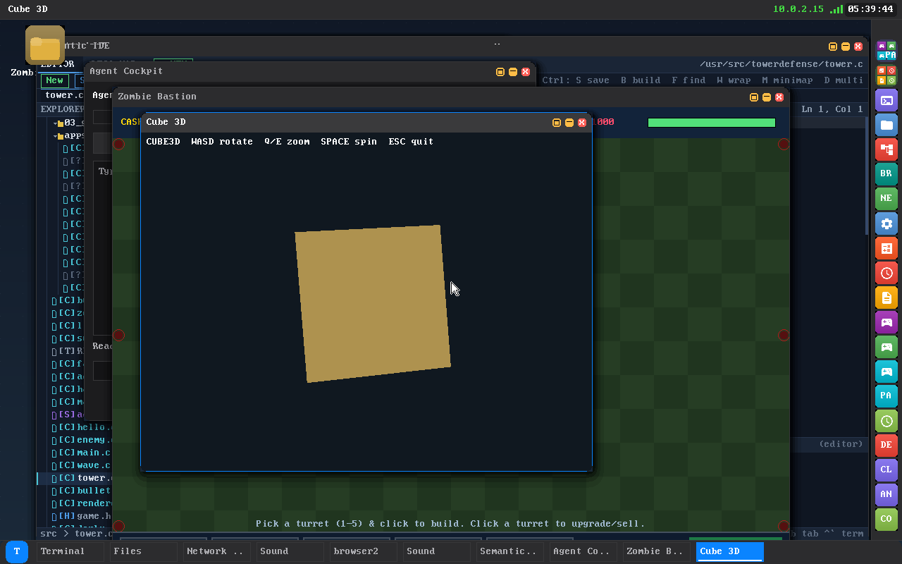
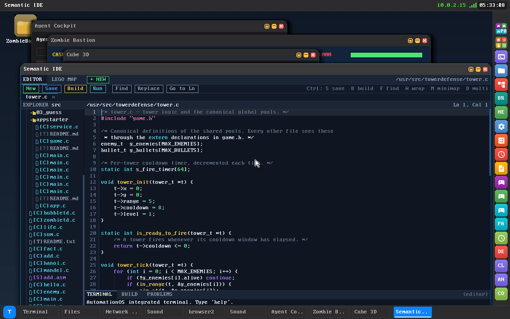

# AutomationOS Wiki

Welcome to the documentation for **AutomationOS** — a from-scratch x86_64 operating
system that boots to a Windows-like graphical desktop on **QEMU and real hardware**
(a 2010 Lenovo ThinkPad T410). Every layer is original code: the kernel, the
compositor, the web browser engine, the C compiler, the TLS stack, the WiFi driver,
and a gated AI agent that can drive the machine.


## Pages

| Page | What's inside |
|------|---------------|
| [Architecture](Architecture.md) | The big picture: boot → kernel → desktop, what's compiled, the directory map |
| [Kernel Internals](Kernel-Internals.md) | Memory, the scheduler (cooperative + gated preempt/SMP), processes, system calls, interrupts |
| [Drivers & I/O](Drivers-and-IO.md) | Framebuffer, PS/2, PCI, storage/AHCI, HDA audio, filesystems, networking |
| [Networking & Security](Networking-and-Security.md) | e1000 + the from-scratch **iwlwifi WiFi driver**, ARP/IP/ICMP/UDP/TCP, sockets, DNS/HTTP/DHCP, hand-rolled crypto + **TLS 1.2 & 1.3**, WPA2/**WPA3-SAE** |
| [Browser & Web Engine](Browser-and-Web-Engine.md) | The from-scratch browser: DOM, HTML parser, CSS, layout, the ES5 JS engine, and the web APIs |
| [Desktop & Apps](Desktop-and-Apps.md) | The compositor, the window protocol, the app suite, games, the AI agent rail, the self-hosting toolchain |
| [Self-Hosting Compiler](Self-Hosting-Compiler.md) | The on-device C compiler: lexer, parser, codegen, assembler, ELF writer, the C subset, and `cc` / the IDE's Ctrl+B build |
| [Building & Running](Building-and-Running.md) | Toolchain, building the kernel + ISO, QEMU, flashing the T410 |
| [Roadmap](../ROADMAP.md) | What's done, in progress, and planned |

## A picture tour

| | |
|---|---|
|  | **Semantic LEGO Map IDE** — code as a navigable blueprint map, with on-device build/run |
|  | **Games** — a software-3D `cube3d` over the from-scratch `g3d`, with the `zombietd` tower-defense behind it |
|  | **The AI agent rail** — a gated, human-supervised cockpit (Allow / Deny / STOP) for an OS-driving agent |
|  | **browser2** — a from-scratch DOM/HTML/CSS/JS browser over a hand-rolled TLS stack |
|  | **WiFi + Network Manager** — scan/connect + a live "Radio:" bring-up diagnostics line |
|  | **The app suite** — IDE, cockpit, games and more, all running at once |

## What makes it interesting

- **It boots on real 2010 hardware**, not just an emulator — from USB, RAM-rooted.
- **Self-hosting**: an on-device C compiler (`cc`) turns C into ELF binaries on the machine itself.
- **The IDE is a forge**: start from a template, **Ctrl+B** to compile, **Ctrl+R** to run.
- **From-scratch browser**: its own DOM, HTML/CSS/layout, a JavaScript engine, over **TLS 1.2 & 1.3**.
- **A from-scratch Intel WiFi driver** (iwlwifi DVM) for the T410 — firmware auto-select + on-screen
  bring-up diagnostics, plus a full WPA2 + **WPA3-SAE** supplicant.
- **A gated AI agent** that can drive the OS (mouse/keyboard/shell/files) through a capability-gated,
  audited (tamper-evident ledger), human-supervised cockpit.
- **A real desktop**: a compositor with a dock, window snap/maximize, a Windows-11 Start menu,
  HDA sound, 25+ apps and games, a circular boot transition, and eased animations.

## Quick start

```sh
# under WSL Arch Linux
bash scripts/quick_build.sh    # build the kernel
bash scripts/build_all.sh      # build userspace + the bootable ISO
bash scripts/smoke_boot.sh     # 43-check boot test in QEMU
```

See [Building & Running](Building-and-Running.md) for QEMU options and flashing a USB for the T410.

## Honest scope

AutomationOS is a hobby OS and a work in progress. The scheduler is **cooperative** by default
(gated `PREEMPT=1` and `SMP=1` builds exist and are validated). It's GRUB Multiboot on legacy
BIOS, not UEFI. The from-scratch **iwlwifi** WiFi driver's logic is known-answer-proven in QEMU,
but the actual radio bring-up on the physical T410 (which has no emulator) is iterated on hardware
via the on-screen diagnostics; WiFi association + the data plane are the next milestones. See the
[Roadmap](../ROADMAP.md) for the full picture.

---
Created from scratch by **fourzerofour** & **Claude**.
