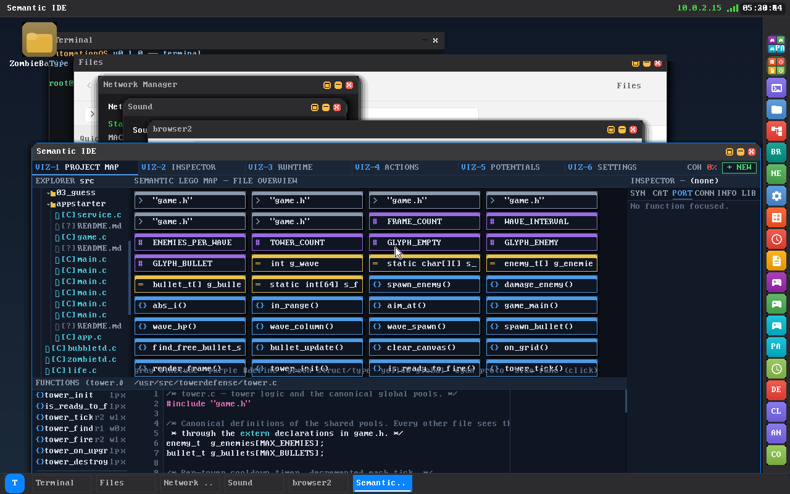
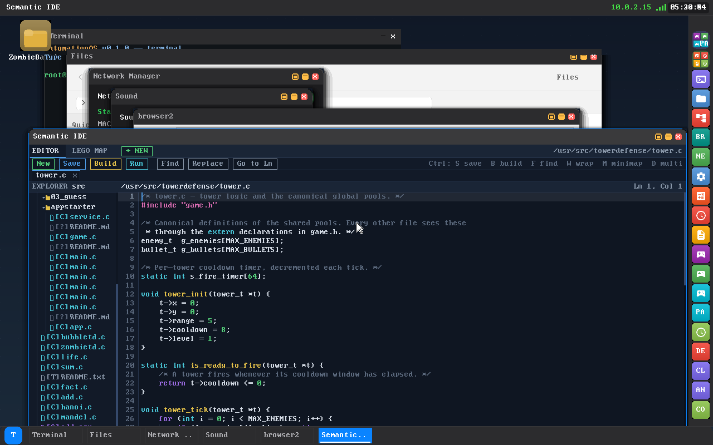

# Self-Hosting Compiler

AutomationOS's headline feature is that it is **self-hosting**: an on-device C
compiler turns C source text into a runnable static ELF64 binary on the machine
itself — no cross-toolchain, no host, no `as`/`ld`. The whole pipeline (lexer,
parser, code generator, assembler, ELF writer) is original freestanding code
that runs in **ring 3** like everything else (no libc, no malloc, no stdio — all
buffers are static), and it is wired into the IDE so you can press **Ctrl+B** to
compile and **Ctrl+R** to run what you just built.

This page documents the pipeline end-to-end, from C text to a running process.
For the editor, the "Semantic LEGO Map," and the desktop the IDE lives in, see
[Desktop & Apps](Desktop-and-Apps.md); for the process model the produced ELF is
spawned into, see [Kernel Internals](Kernel-Internals.md).



---

## One toolchain, two front-ends

There is exactly **one** compiler. It lives in `userspace/apps/ide/` as a set of
freestanding translation units, and it is exposed two ways:

- **`/bin/cc`** ([`userspace/apps/cc/cc.c`](../../userspace/apps/cc/cc.c)) — the
  command-line compiler. It is a thin **driver**: it contains no compiler, it
  links the IDE's toolchain objects and runs exactly their pipeline. Usage is
  `cc INPUT.c -o OUTPUT` (defaults to `./a.out`; a bare `cc` runs the self-test).
- **The IDE** ([`userspace/apps/ide`](../../userspace/apps/ide)) — drives the
  same objects from `tc_build()` ([`tc_driver.c`](../../userspace/apps/ide/tc_driver.c))
  behind the **Ctrl+B** build action.

The shared contract is [`tc.h`](../../userspace/apps/ide/tc.h), which both
front-ends include. The pipeline is:

```
C source text  --(lex_tokenize + parse_translation_unit)-->  AST (AstNode* tu)
AST            --(cc_compile)----------------------------->  Intel-subset x86-64 asm text
asm text       --(as_assemble @ TC_ENTRY_VADDR)----------->  x86-64 machine code (bytes)
machine code   --(elf_write)------------------------------>  static ELF64 the OS loader runs
```

Every stage is freestanding and takes fixed caller-supplied buffers
(`TC_ASM_CAP` 128 KiB, `TC_CODE_CAP` 64 KiB, `TC_ELF_CAP` 96 KiB; diagnostics
collect into a `TcDiag[TC_MAXDIAG]` array). Anything unsupported funnels through
a diagnostic and degrades gracefully — the compiler never crashes the machine.

---

## Stage 1 — the lexer (`ide_lex.c`)

[`ide_lex.c`](../../userspace/apps/ide/ide_lex.c) (header
[`ide_lex.h`](../../userspace/apps/ide/ide_lex.h)) is the C tokenizer, shared
between the parser and the code-view syntax highlighter. `lex_tokenize()` fills a
caller-supplied `Tok[]` array (no allocation) and appends a trailing `TK_EOF`.
Token kinds are `TK_ID`, `TK_KW`, `TK_TYPE` (type-ish keywords: `int`/`char`/
`void`/`struct`/…), `TK_NUM`, `TK_STR`, `TK_CHAR`, `TK_COMMENT`, `TK_PREPROC`
(a `#…` line), and `TK_PUNCT`. Each token points into the source buffer and
carries its 1-based line and 0-based column.

> Important: `#…` lines are tokenized as `TK_PREPROC`, but they are **not
> preprocessed**. The parser strips every `TK_COMMENT` and `TK_PREPROC` token
> before parsing (see Stage 2), so `#include` and `#define` are silently
> dropped — they have no semantic effect. See the honest-scope section below.

---

## Stage 2 — the parser (`ide_parse.c` + friends)

The parser is a **recursive-descent C parser** split across mutually-recursive
translation units behind one shared contract,
[`ide_parser.h`](../../userspace/apps/ide/ide_parser.h):

| Unit | Role |
|------|------|
| [`ide_pcore.c`](../../userspace/apps/ide/ide_pcore.c) | `parser_init`, the cursor API, the type-name table, and `parse_translation_unit` (loops `parse_declaration` until EOF) |
| [`ide_pdecl.c`](../../userspace/apps/ide/ide_pdecl.c) | declarations: var decls, typedefs, `struct`/`union`/`enum`, function prototypes and full function definitions; type-and-declarator + parameter lists |
| [`ide_pstmt.c`](../../userspace/apps/ide/ide_pstmt.c) | `parse_statement`, `parse_compound`, panic-mode recovery |
| [`ide_pexpr.c`](../../userspace/apps/ide/ide_pexpr.c) | `parse_expression` (comma) and `parse_assignment` (precedence-climbing) |

`parser_init()` tokenizes the source, then **compacts the token stream** —
dropping `TK_COMMENT` and `TK_PREPROC` — so the grammar never sees comments or
preprocessor lines. Output is a unified AST (`AstNode`, see
[`ide_ast.h`](../../userspace/apps/ide/ide_ast.h)) allocated from a fixed pool;
`parse_translation_unit` sets the root and returns an `AST_TU` node.

The parser obeys a strict **cursor-ownership contract** (each `parse_X` consumes
exactly its construct and leaves the cursor on the first token after it) and a
hard rule that the cursor always makes forward progress, so malformed input can
never spin. On error it records a diagnostic, recovers, and returns a best-effort
placeholder node (never NULL for a required production) so codegen never
dereferences garbage. Type names are resolved with the classic "lexer hack"
(`is_typename()`); `parse_declaration` registers new `typedef` names via
`add_typename()`.

---

## Stage 3 — types (`cc_type.c`)

[`cc_type.c`](../../userspace/apps/ide/cc_type.c) is **not** a validating type
checker — it is a small set of size/pointer helpers plus a best-effort
expression **type inferencer** the code generator consults to scale pointer
arithmetic and to pick byte-vs-qword loads/stores. The v1 type model is
deliberately coarse:

- `char` / `signed char` / `unsigned char` / `_Bool` / `bool` → **1 byte**.
- everything else — `int`, `long`, `unsigned`, pointers, typedef'd handles → **8
  bytes**. Any type string containing `*` is a pointer (8 bytes).
- A **struct registry** scans the AST for `AST_RECORD`/`typedef` records and lays
  their fields out sequentially (char/`_Bool` = 1, everything else = 8; non-char
  fields 8-aligned; unions give every field offset 0). `cc_member_offset()`
  returns a field's byte offset; an unknown type/field falls back safely to
  offset 0, size 8.

`cc_infer_type()` walks an expression (identifiers via their AST declaration,
`*p`/`&x` adding or peeling one level of indirection, `a[i]` and `p->f` resolving
through the registry) and is depth-bounded. It is explicitly "good enough for
v1," not full C semantic analysis: there is no real type checking, no
conversions/promotions diagnosed, no `const`/signedness enforcement.

---

## Stage 4 — code generation (`cc_codegen.c` + `cc_expr.c`)

[`cc_codegen.c`](../../userspace/apps/ide/cc_codegen.c) walks the AST and emits
**Intel-syntax assembly text** restricted to exactly the subset the native
assembler accepts. Expressions are handled by
[`cc_expr.c`](../../userspace/apps/ide/cc_expr.c) (`cg_expr` evaluates an rvalue
into RAX; `cg_addr` computes an lvalue address into RAX); state lives in the `Cg`
struct ([`cc.h`](../../userspace/apps/ide/cc.h)).

**Calling convention** (self-consistent, SysV-like, used by *generated* code):

- arguments in `rdi, rsi, rdx, rcx, r8, r9` (≤ 6); return value in `rax`.
- standard frame: `push rbp` / `mov rbp, rsp` / `sub rsp, frame`; locals at
  `[rbp-off]` (each slot 8 bytes wide, even for `char`); `rsp` 16-byte aligned at
  each `call`.
- a per-function pre-pass allocates a stack slot for every parameter and every
  `AST_VAR_DECL` in the body; each function gets one shared epilogue label so
  every `return` jumps to a single exit (`leave` / `ret`).

The program driver emits, in order: module-scope globals, a `.text` section with
a `global _start` trampoline, each function definition, then a `.data` section
holding zero-initialized globals (`dq 0`, arrays expanded by length) and interned
string literals (`db "...", 0`). The **`_start` trampoline** is:

```asm
_start:
    call main          ; (or the first function if there's no main)
    mov rdi, rax       ; exit code = main's return value
    mov rax, 0         ; SYS_EXIT == 0 on AutomationOS
    syscall
```

so the produced ELF carries its own entry point and is self-contained — compiled
programs do **not** link `crt0`.

> Source caveat to reconcile: the header comments in `cc.h`/`cc_codegen.c` say
> the trampoline ends `mov rax, 1 ; syscall`, but the actual emitted code (and
> `tc.h`) use `mov rax, 0` for `SYS_EXIT`. The **code is correct** (`SYS_EXIT`
> is `0` on AutomationOS); the "`rax,1`" in those comments is stale.

---

## Stage 5 — the assembler (`as_x64.c`)

[`as_x64.c`](../../userspace/apps/ide/as_x64.c) is a real, on-device **two-pass
x86-64 assembler** that turns the codegen's Intel-syntax text into **machine-code
bytes directly** — it does not shell out to GAS, and it does not stop at text.
Pass 1 lays `.text` from the fixed base address and `.data` right after it,
collecting label addresses; pass 2 encodes each line, resolving labels to
absolute `imm64` (for `mov reg, label`) or `rel32` (for `call`/`jmp`/`jcc`). A
single `enc_line` encoder runs in both passes (with a NULL output buffer it only
measures), so pass-1 sizes always match pass-2 emission.

The accepted assembly subset is documented in `tc.h` and is exactly what the C
codegen emits — Intel syntax, one instruction per line:

- **directives** `section .text` / `section .data`, `global NAME` (accepted, no
  effect); **labels** `name:`; **data** `db` (bytes / `"str"` runs) and `dq`
  (immediate or label) in `.data`.
- **registers** `rax`…`r15`, plus `al` (low byte for `char`) and `cl` (shift
  count); **operands** register / immediate (decimal or `0x…`) / label / memory
  `[reg]`, `[reg±disp]`.
- **instructions** `mov` (incl. `movzx reg, byte [mem]` and `mov byte [mem], al`),
  `lea`, `push`/`pop`, `add`/`sub`/`imul`, `cqo`/`idiv`, `and`/`or`/`xor`,
  `shl`/`shr`, `neg`/`not`, `cmp`/`test`, `setcc al`, `jmp`/`jcc`, `call`/`ret`/
  `leave`, and `syscall`.

Label addressing is **absolute** (non-PIE, fixed load base). `;` is the comment
character; an unknown mnemonic produces a diagnostic rather than bad bytes.

---

## Stage 6 — the ELF writer (`elf_write.c`)

[`elf_write.c`](../../userspace/apps/ide/elf_write.c) wraps the machine code in a
**minimal static ELF64** that matches the same load model the rest of userspace
uses (`kernel/fs/exec.c` + `userspace.ld`). It writes every field explicitly in
little-endian at its exact offset, so the result is correct regardless of host
endianness or struct packing. The layout is just:

```
[ Elf64_Ehdr = 64 ][ one Elf64_Phdr = 56 ][ code... ]     (120 + code_len bytes)
```

| Field | Value |
|-------|-------|
| class / data / type / machine | `ELFCLASS64`, `ELFDATA2LSB`, `ET_EXEC`, `EM_X86_64` (62) |
| program headers | exactly **one** `PT_LOAD`, flags `R|W|X` |
| `p_offset` / `p_vaddr` / `p_paddr` | `0` / `0x200000` / `0x200000` |
| `p_filesz` = `p_memsz` | whole file (`120 + code_len`) |
| `e_entry` | `0x200000 + 120` = `0x200078` (the first emitted instruction = `_start`) |
| section headers | none (`e_shoff` = 0) |

This is the identical `_start` / load-at-`0x200000` convention every userspace
ELF on AutomationOS follows: a static, non-PIE, R/W/X single-segment image
entered with `RSP` 16-byte aligned and **no** `argc`/`argv`.

---

## The supported C subset (verified from source)

Per the `cc.h` / `tc.h` headers and the implementations, the compiler accepts a
real but deliberately small C subset:

- **Types**: `int` / `long` / `char` / `_Bool` / pointers — all integer/pointer
  types are 64-bit **except** `char`/`_Bool`, which are 1 byte. `struct` (and
  `union`/`enum` and `typedef`) are parsed and structs get sequential field
  layout for member access.
- **Storage**: global and local scalar (int/char/pointer) variables; arrays
  (`int a[4]`); string literals (emitted to `.data`). **Constant initializers**
  are honoured — a file-scope `int x = 5;` emits `dq 5`, an array `int a[]={1,2}`
  emits its elements (unset slots zero-fill), and a known `struct` initializer is
  laid out field-by-field (`db` for 1-byte fields, `dq` otherwise) via the struct
  registry. File-scope initializers must fold to an integer constant
  (`cc_const_eval`); a non-constant initializer falls back to `dq 0`.
- **Functions**: definitions and prototypes, **≤ 6 parameters**, `return`, and
  recursion.
- **Control flow**: `if` / `else`, `while`, `for`, **`switch` / `case` /
  `default`**, `break`, `continue`, blocks. `switch` is lowered to a linear
  compare-and-jump dispatch (`gen_switch` in `cc_codegen.c`): each `case`
  constant is folded with `cc_const_eval`, the body is emitted in source order so
  **fall-through works naturally**, and `break` exits via the shared end label.
  Limit: **≤ 32 cases** per `switch`.
- **Operators**: `+ - * / % & | ^ << >> ! ~`, unary `-`, `&& ||`,
  `== != < <= > >=`, `=` and the compound-assignment forms; `*p` deref, `&x`
  address-of, `a[i]` index, `s.field` / `p->field` member access.
- **I/O**: two builtins — `sys_write(fd, buf, len)` and `sys_exit(code)` — that
  emit a `syscall` directly. These are the supported way for a compiled program
  to do I/O.

### What it does **not** support (honest scope)

This is a v1 compiler, and the source is candid about the gaps:

- **No preprocessor.** `#include` / `#define` / `#ifdef` are lexed then
  **discarded** — they do nothing. A program must be a single self-contained
  `.c` file with no macros and no headers; the builtins (`sys_write`/`sys_exit`)
  are recognized by name without any declaration.
- **No real type checking.** `cc_type.c` only *infers* types to scale pointer
  arithmetic and choose load widths; it does not diagnose type errors, integer
  promotions, signedness, or `const`.
- **No floating point in `cc`** — the codegen is integer-only (no `long double`,
  no float or `unsigned`-specific codegen; everything is 64-bit integer). This is
  a *compiler* limitation, **not** a kernel one: SSE/FPU is enabled and
  context-switched for ring 3 (paging.c `cpu_enable_fpu_sse` + per-task
  `fxsave`/`fxrstor`), so gcc-built userspace uses floats fine — see `sbin/floattest`.
- **No standard library** — there is no libc, no `printf`, no `malloc`; only the
  two syscall builtins. **No inline `__asm__`** in the C front-end (the assembler
  is a separate path; only the codegen's own emitted asm is assembled).
- **Capacity limits**, not arbitrary programs: ≤ 96 locals/function, ≤ 64
  globals, ≤ 64 string literals, ≤ 6 parameters; ≤ 16384 tokens.
- **No optimization, no linking** of multiple objects, no separate compilation —
  one `.c` in, one ELF out.

### Other languages

`tc_build` classifies by extension. **`.asm`/`.s`** is passed verbatim to the
assembler (the Intel subset above), so hand-written assembly compiles to an ELF
too. **`.cpp`/`.cc`/`.cxx`** is attempted *best-effort as C* (no C++ semantics).
**`.cs`** is rejected outright — "C# needs a CLR/.NET runtime — not supported."

---

## How the IDE drives it



Inside the IDE, the toolchain is the **Build** panel
([`ide_build.c`](../../userspace/apps/ide/ide_build.c)). The relevant chords
(`ide.c`):

- **Ctrl+N — New Project.** Opens a templates picker over
  `/usr/src/templates/`, which build_all.sh populates with three starters:
  **`gamestarter`**, **`appstarter`**, and **`servicestarter`**. Choosing one
  clones the template directory into `/usr/src/<name>/` and opens its main `.c`.
  The app and service starters are heavily commented, dual-path templates (they
  build with the on-device `cc` using the `sys_write`/`sys_exit` builtins, and
  also document the desk GCC flags).
- **Ctrl+B — Build.** `ide_do_build()` flushes unsaved edits, then runs
  `tc_build()` on the open file and caches the `TcResult`. The Build panel shows
  `OK`/`FAILED [lang]`, the output path, code/ELF sizes, the toolchain message,
  a diagnostics list, and an **asm preview** of the generated assembly. By
  default the ELF is written to **`/Desktop/<basename>`** (falling back to
  `/tmp/<basename>`), so a freshly built program lands on the desktop.
- **Ctrl+R — Run.** `ide_do_run()` spawns the most recently built ELF via
  **`SYS_SPAWN`** (syscall 16) and reports the new pid (or the spawn error).

Because the compositor periodically rescans `/Desktop`, a program compiled in the
IDE can appear as a desktop icon and be double-clicked to launch without a
restart. (See [Desktop & Apps](Desktop-and-Apps.md) for the compositor and the
window protocol.)

---

## The boot self-test (proof it works)

`init` spawns **`bin/cc`** with no arguments at boot
([`userspace/init/main.c`](../../userspace/init/main.c)). With no input file, `cc`
runs its built-in self-test: it compiles the tiny in-subset program

```c
int main(){ sys_write(1, "hi", 2); return 0; }
```

through the full lex → parse → codegen → assemble → ELF pipeline, writes the
result to `/tmp/cc_out`, **reopens it, and verifies the first four bytes are the
ELF magic** (`\x7F E L F`). On success it prints `CC SELFTEST: PASS`.

The boot smoke test gates on exactly this. `check_compiler()` in
[`scripts/smoke_boot.sh`](../../scripts/smoke_boot.sh) asserts the marker and
reports:

| Marker | Meaning |
|--------|---------|
| `CC SELFTEST: PASS` | smoke prints **"on-device C compiler verified (self-hosting: source → ELF)"** |
| `CC SELFTEST: FAIL …` | the failing stage (`compile` / `assemble` / `elfwrite` / `write` / `reopen` / `magic`) |
| (no marker) | "cc did not report (compiler hung or never ran)" |

A green boot therefore means the OS built a real executable from C source, on the
machine, end-to-end.

---

## See also

- [Home](Home.md)
- [Architecture](Architecture.md)
- [Kernel Internals](Kernel-Internals.md)
- [Desktop & Apps](Desktop-and-Apps.md)
- [Browser & Web Engine](Browser-and-Web-Engine.md)
- [Building & Running](Building-and-Running.md)
- [Roadmap](../ROADMAP.md)
